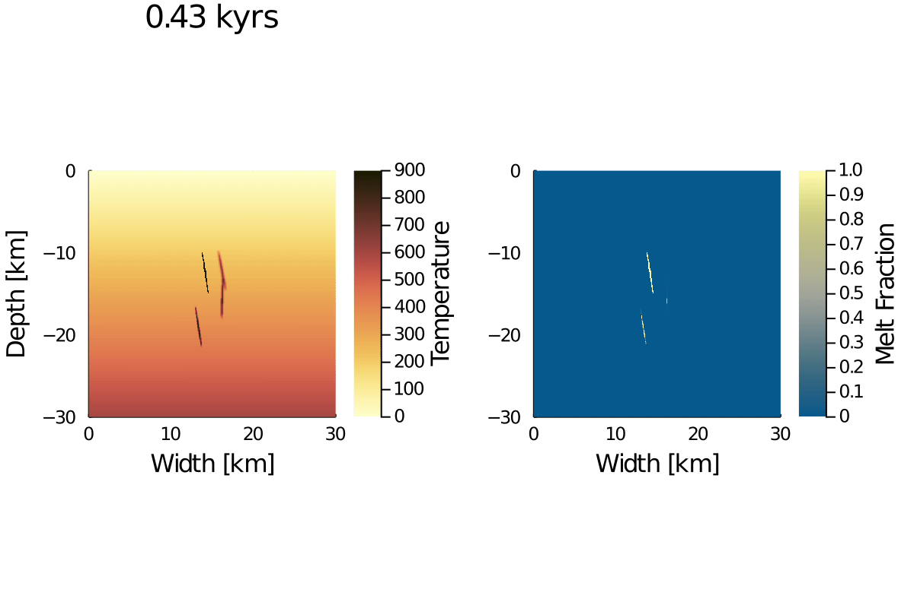

# ZirconThermoKinematics.jl

Understanding how magmatic systems evolve and how the rock record can be interpreted is of interest to a wide range of Earth Scientists.

This easy to use and versatile package simulates the thermal evolution of magmatic systems, consisting of (kinematically) emplaced dikes. It can take 2D, 2D axisymmetric and 3D geometries into account, and works in parallel on both CPU (and GPU's). A finite difference discretization is employed for the energy equation, combined with semi-lagrangian advection and tracers to track the thermal evolution of emplaced magma. Dikes are emplaced kinematically and the host rock is shifted to accommodate space for the intruding dikes/sills. Cooling, crystallizing and latent heat effects are taken into account, and the thermal evolution of tracers can be used to simulate zircon age distributions.

Below we give a number of example scripts that show how it can be used to simulate a number of scenarios.


## Contents
  - [100-lines 2D example](#100-lines-2d-example)
  - [Dependencies](#dependencies)
  - [Installation](#installation)

## 100-lines 2D example
A simple example that simulates the emplacement of dikes within the crust over a period of 10'000 years is shown below. 



The code to simulate this, including visualization, is only 100 lines and the key parts of it are shown below
```
# Load required packages
#(...) 

#------------------------------------------------------------------------------------------
@views function MainCode_2D();

# Model parameters
W,H                     =   30, 30;                 # Width, Height in km
ρ                       =   2800;                   # Density 
cp                      =   1050;                   # Heat capacity
k_rock, k_magma         =   1.5, 1.2;               # Thermal conductivity of host rock & magma
L                       =   350e3;                  # Latent heat J/kg/K
GeoT                    =   20.0;                   # Geothermal gradient [K/km]
x_in,z_in               =   20e3,   -15e3;          # Center of dike [x,z coordinates in m]
W_in, H_in              =   5e3,    2e2;            # Width and thickness of dike [m]
T_in                    =   900;                    # intrusion temperature
InjectionInterval_kyrs  =   0.1;                    # inject a new dike every X kyrs
maxTime_kyrs            =   15;                     # Maximum simulation time in kyrs
H_ran, W_ran, Angle_ran =   H/4.0, W/4.0, 90.0;     # size of domain amdin which we randomly place dikes and range of angles   
DikeType                =   "ElasticDike"           # Type to be injected ("SquareDike","ElasticDike")

Nx, Nz                  =   500, 500;                           # resolution
dx                      =   W/(Nx-1)*1e3; dz = H*1e3/(Nz-1);    # grid size [m]
κ                       =   k_rock./(ρ*cp);                     # thermal diffusivity   
dt                      =   min(dx^2, dz^2)./κ/20;              # stable timestep (required for explicit FD)
nt                      =   floor(maxTime_kyrs*1e3*SecYear/dt); # number of required timesteps
nTr_dike                =   100;                                # number of tracers inserted per dike


#(...) 
# Initialize numerical parameters and arrays
#(...) 

# Initial geotherm and melt fraction
T                       .=   -Z./1e3.*GeoT;                                 # Initial (linear) temperature profile
SolidFraction!(T, Phi_o, Phi, dPhi_dt, dt);                                 # Compute solid fraction

# Preparation of visualisation
#(...)

InjectVol = 0.0;
time,time_kyrs, dike_inj = 0.0, 0.0, 0.0;
for it = 1:nt   # Time loop

    if floor(time_kyrs/InjectionInterval_kyrs)> dike_inj        # Add new dike every X years
        dike_inj            =   floor(time_kyrs/InjectionInterval_kyrs)                                     # Keeps track on whether we injected already
        cen                 =   [W/2.; -H/2.]; center = (rand(2,1) .- 0.5).*[W_ran;H_ran] + cen;            # Random variation of location (over a distance )
        dike                =   Dike(Width=W_in, Thickness=H_in,Center=center[:]*1e3,Angle=(rand(1).-0.5).*Angle_ran,Type=DikeType,T=T_in); # Specify dike with random location/angle but fixed size 
        Tracers, T, Vol     =   InjectDike(Tracers, T, Grid, Spacing, dike, nTr_dike);                      # Add dike, move hostrocks
        InjectVol           +=  Vol                                                                         # Keep track of injected volume
        println("Added new dike; total injected magma volume = $(InjectVol/1e9) km³; rate Q=$(InjectVol/(time_kyrs*1e3*SecYear)) m³/s")
    end

    SolidFraction!(T, Phi_o, Phi, dPhi_dt, dt);                                                 # Compute solid fraction
    K               .=  Phi.*k_rock .+ (1 .- Phi).*k_magma;                                     # Thermal conductivity

    # Perform a diffusion step
    @parallel diffusion2D_step!(Tnew, T, qx, qz, K, Kx, Kz, Rho, Cp, dt, dx, dz,  L, dPhi_dt);  
    @parallel (1:size(T,2)) bc2D_x!(Tnew);                                                      # set lateral boundary conditions (flux-free)
    Tnew[:,1] .= GeoT*H; Tnew[:,end] .= 0.0;                                                    # bottom & top temperature (constant)
    
    Tracers         =   UpdateTracers(Tracers, Grid, Spacing, Tnew, Phi);                       # Update info on tracers 
    T, Tnew         =   Tnew, T;                                                                # Update temperature
    time, time_kyrs =   time + dt, time/SecYear/1e3;                                            # Keep track of evolved time
    println(" Timestep $it = $(round(time/SecYear)/1e3) kyrs")

    if mod(it,20)==0  # Visualisation
        Phi_melt    =   1.0 .- Phi;             
        x_km, z_km  =   x./1e3, z./1e3;
        p1          =   heatmap(x_km, z_km, T',         aspect_ratio=1, xlims=(x_km[1],x_km[end]), ylims=(z_km[1],z_km[end]),   c=:inferno, title="$(round(time_kyrs, digits=2)) kyrs", xlabel="Width [km]",ylabel="Depth [km]", dpi=200, fontsize=6, colorbar_title="Temperature")
        p2          =   heatmap(x_km, z_km, Phi_melt',  aspect_ratio=1, xlims=(x_km[1],x_km[end]), ylims=(z_km[1],z_km[end]),   c=:vik,     xlabel="Width [km]", clims=(0.,1.), dpi=200, fontsize=6, colorbar_title="Melt Fraction")
        plot(p1, p2, layout=(1,2)); frame(anim)
    end

end
gif(anim, "Example2D.gif", fps = 15)   # create gif animation
return Tracers, T, Grid;
end # end of main function

Tracers,T,Grid = MainCode_2D(); # start the main code
```
The main routines are thus ``InjectDike(..)``, which inserts a new dike (of given dimensions and orientation) into the domain, and ``diffusion2D_step!(...)``, which computes thermal diffusion. Variable thermal conductivity, and latent heat are all taken into account. 

The full code example can be downloaded [here](./examples/Example2D.jl)

## Dependencies
We rely on `ParallelStencil.jl` to for the energy solver, `StructArrays.jl` to generate an aray of tracer structures, and `Random.jl` for random number generation, `Parameters.jl` to simplify setting parameters (such as specifying dike properties), and `Interpolations.jl` to interpolate properties such as temperature from a fixed grid to tracers. All these dependencies should be installed automatically if you download `ZirconThermoKinematics.jl`.

`Plots.jl` is employed for plotting, and `WriteVTK.jl` is used in the 3D example to generate *.VTR files that can be visualized with [Paraview](https://www.paraview.org). You have to add both packages yourself; they are however anyways useful to have.

## Installation
This is a julia package, so after installing julia in the usual manner, you can add the package with 
```
julia>]
  pkg> add https://github.com/boriskaus/ZirconThermoKinematics.jl
```
Next, you can download one of the code above, put it in the directory you are and start it with
```
julia> include("Example2D.jl")
```
If you want to do a full testing of the package on your system, you can run the testing framework from within the package manager:
```
julia>]
  pkg> test ZirconThermoKinematics
```


